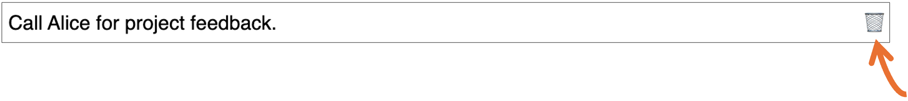

# Notes

Notes are simple items in the TaskHive app that contain ideas or points that you note down so that you can reference them later. These could be discussion points from a meeting, a thought, or some piece of information that you want to quickly record. 

## Add a note

To add a note:

1. Under the **Notes** section, use the **New note…** box to type your note and then click **Add**.

TaskHive adds your note to the list.

> 📘 **Note**
> TaskHive doesn’t support rich text and multi-line notes, yet. We’re working towards it, and soon you can create multiline notes.

## Delete a note

To delete a note:

1. Click on the note’s trash bin button to delete it. TaskHive deletes the note and removes it from the list.

