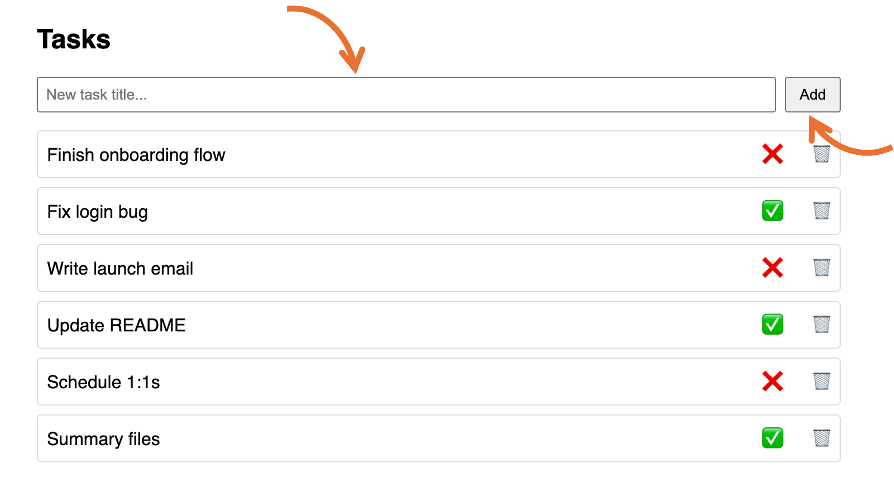
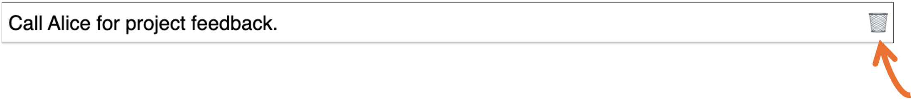

# Tasks

Tasks are items that you want to do. In simpler terms, tasks form your to-do list.  Add your tasks to TaskHive so that you get the to-do list and you can keep a track of things that need your attention and optimize your productivity.
Each task on the TaskHive app has its status attached to it. The status is either of the following:
- Complete: The green check mark icon ✅ states that the task is complete.
- Incomplete: The red cross ❌ icon states that the task is incomplete. 

## Add a task

To add a task:
1. Under the **Tasks** section, use the **New task title…** box to provide your task’s title and then click **Add**.

> 📘 **Note**
> You cannot provide descriptions and multi-line details for a task at this point. We’re working towards it and very soon you will get an option to add task descriptions with details that span across multiple lines.

> ℹ️ **Info**
> TaskHive adds your task to the list. By default, the task is added as an incomplete task. Click on the status icon to change the task’s status as complete or incomplete.

## Delete a task

To delete a task:
1. Click on the task’s trash bin button 🗑️ to delete it. TaskHive deletes the task and removes it from the list.

